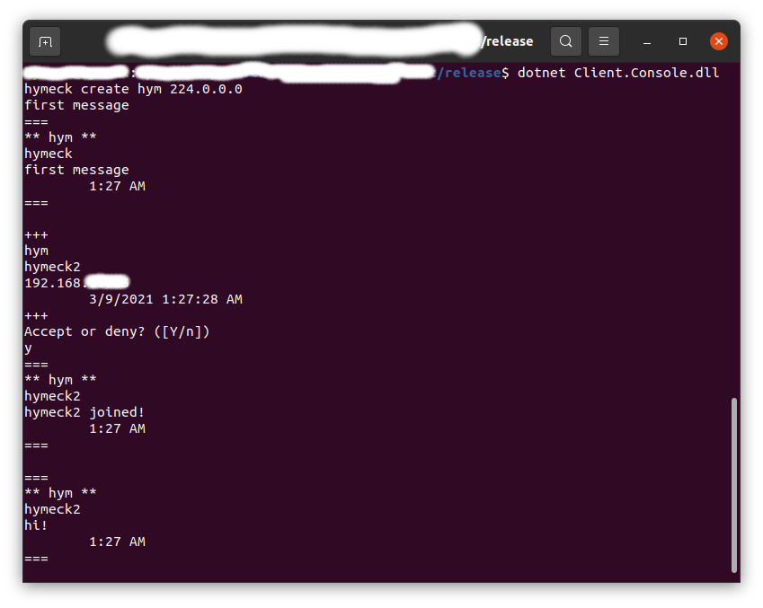
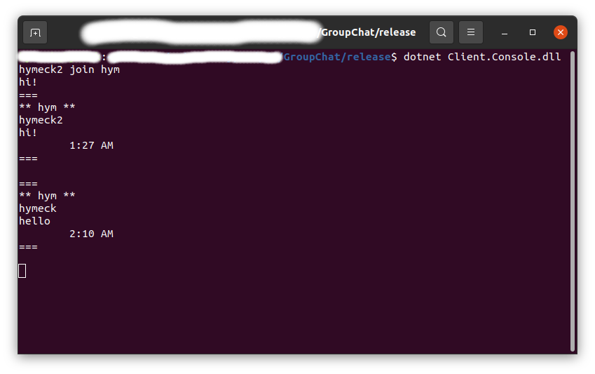

# Group Chat

## How to run demo
### _Prerequisites_
- [.NET 5 SDK](https://dotnet.microsoft.com/download/dotnet/5.0)

1. Clone project.
   
   ```git clone https://github.com/Hymeck/GroupChat```

2. Build solution. _(Builded stuff will be placed in `release` folder.)_

`dotnet publish -c Release -o release src/GroupChat.sln`

3. Go to `release` folder.

`cd release`

4. Run.


`dotnet Client.Console.dll [username] [command] [<options>]`

`username` - username will be used to display in message.

`command` - `create` or `join` used to create a group or to join a group.

`options` - options used to configure `command`. To find out more, run demo without any arguments _(see example below)_.

`dotnet Client.Console.dll` - prints help.

## Run Example

- In creating case, command line arguments look like this:

`hymeck create hym 224.0.0.0`

Full command:

`dotnet Client.Console.dll hymeck create hym 224.0.0.0`

- In joining case, command line arguments are specified below:

`hymeck2 join hym`

Full command:

`dotnet Client.Console.dll hymeck2 join hym`

 
_Create group example_

 _Join group example_ 

## Links that helped during developing
- [Enable and disable root](https://linuxize.com/post/how-to-enable-and-disable-root-user-account-in-ubuntu/)
- [Docker permission denied](https://medium.com/@dhananjay4058/solving-docker-permission-denied-while-trying-to-connect-to-the-docker-daemon-socket-2e53cccffbaa)
- [Dockerize .NET application](https://docs.microsoft.com/en-us/dotnet/core/docker/build-container?tabs=linux)
- [UDP multicast](https://sashadu.wordpress.com/2016/06/10/c-udp-multicast/)
- [Handle Ctrl+C termination](https://social.msdn.microsoft.com/Forums/en-US/4c9ff01a-a79c-42ef-8fd0-19480e8a1e0f/custom-hotkey-to-interrupt-an-infinite-while-loop?forum=csharpgeneral)
- [.NET XML documentation example](https://github.com/dotnet/aspnetcore)
- [UdpClient BeginReceive/EndReceive example](https://gist.github.com/zmilojko/5055246)
- [Delegate.BeginInvoke for .NET Core](https://devblogs.microsoft.com/dotnet/migrating-delegate-begininvoke-calls-for-net-core/)